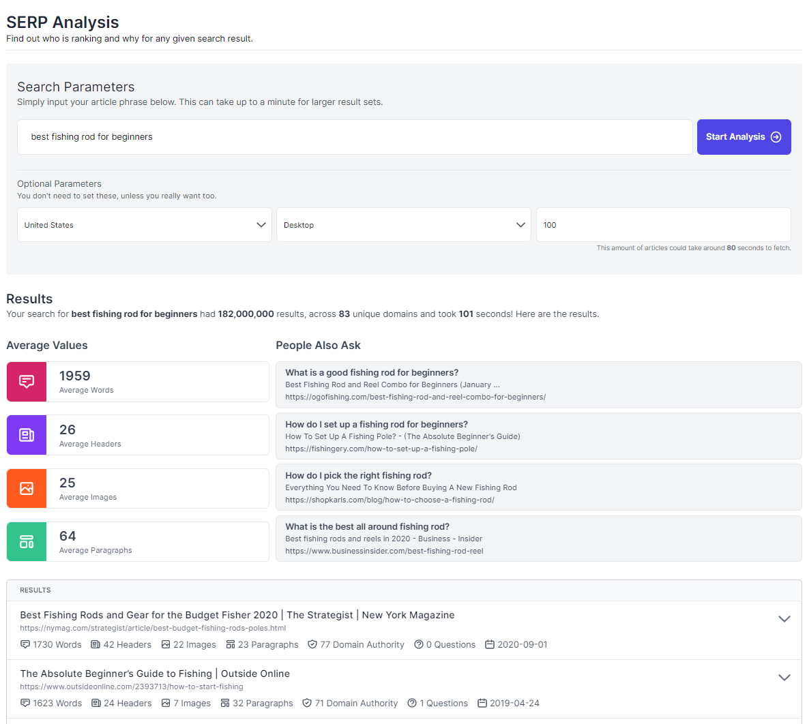

## Rubric SEO

Front end of Rubric built using [TailwindCSS](https://tailwindcss.com) & [Vue.js](https://vuejs.org). This project is also running [Vuex](https://vuex.vuejs.org) in order to control the sidebar state throughout components. Original dashboard layout by [Murked](https://github.com/Murked/vue-tailwind-admin)

#### Screenshot



#### Project setup

```
npm install
```

#### Compiles and hot-reloads for development

```
npm run serve
```

<!-- #### License
MIT License. -->
